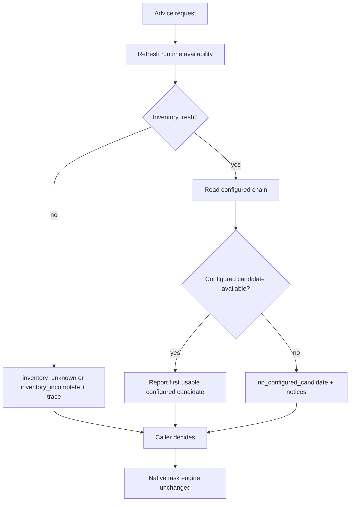

## Goal Capsule

- **Objective:** Give an OMO/Senpi operator and main agent current, explainable advice about configured subagent model availability without changing native dispatch.
- **Product authority:** This plan owns advisory runtime inventory, configured-route assessment, and decision reporting. It does not own routing enforcement, task admission, fallback dispatch, or native task lifecycle.
- **Open blockers:** None.

---

## Product Contract

### Summary

Add an advisory model-status surface that reads current runtime inventory and assesses configured subagent routes. It reports usable configured candidates, unavailable or unknown inventory, and provider-boundary implications without selecting, approving, or dispatching fallbacks.

### Problem Frame

Static `omo.jsonc` chains and curated matrix documents drift when providers, credentials, or extension catalogs change. Current operator guidance requires catalog verification before routing and warns that a provider change alters the task-content data boundary. A route failure therefore either stalls work or encourages unsafe, opaque manual fallback.

### Key Decisions

- **Advisory-only first release.** Report runtime availability and configured-route status without intercepting or changing any task admission. Governs R1-R6. (session-settled: user-directed — chosen over full live enforcement: no supported Senpi hook covers direct tasks, DAG nodes, workpool workers, and team members while native scheduling stays owned by Senpi.)
- **Fresh runtime inventory governs status.** A failed or stale availability refresh produces an explicit unknown result, never a claim that inventory is complete. Governs R1, R2.
- **Configured order remains report order.** The advisor reports the first confirmed usable configured candidate, but does not rank or select unconfigured alternatives. Governs R4.
- **Provider changes stay operator decisions.** The advisor identifies a cross-provider boundary but does not create policy, request approval, or authorize dispatch. Governs R4, R6.

### Actors

- A1. **Main OMO/Senpi agent** requests route-status advice and consumes a structured report before deciding how to delegate.
- A2. **OMO operator** inspects current availability, configured-route status, evidence freshness, and provider-boundary notices.
- A3. **Native OMO/Senpi task engine** independently resolves and executes work; it receives no route mutation or dispatch authorization from this product.

### Requirements

**Live inventory and evidence**

- R1. The advisor must use supported `ctx.modelRegistry` and `modelRuntime` surfaces to inspect effective native and extension model inventory without a hardcoded provider allowlist.
- R2. The advisor must return `inventory_unknown` for a failed, aborted, or non-fresh availability refresh and `inventory_incomplete` when relevant provider coverage cannot be established; `getAvailable()` alone is not complete-inventory proof.
- R3. The advisor must distinguish runtime availability from curated catalog evidence; catalog evidence may explain a model but never changes its reported runtime state.

**Configured-route advice**

- R4. For a supplied named-agent or category route, the advisor must report configured candidates in order and identify the first candidate confirmed available in current inventory.
- R5. The advisor must return `no_configured_candidate` only when inventory is fresh and complete for the route's relevant providers; otherwise it must return the applicable inventory status with no automatic fallback recommendation.
- R6. The advisor must identify a configured provider transition or unconfigured alternative as a data-boundary notice, not a policy decision, approval request, or authorization.

**Shared observability and containment**

- R7. One structured report must serve automation and operator inspection, with compact decisive status plus an expandable trace containing source, age, freshness, identity method, missing signals, and rejection reasons.
- R8. Reports must exclude task content, credentials, access tokens, endpoint secrets, and raw provider responses; result sharing and retention remain caller-owned.
- R9. The advisor must not modify task input, selected model, `omo.jsonc`, agent registry, task lifecycle, retries, cancellation, results, or DAG scheduling.

### Key Flows

- F1. Configured route is available
  - **Trigger:** A1 or A2 requests advice for a named-agent or category route.
  - **Actors:** A1, A2.
  - **Steps:** Advisor refreshes availability, reads the effective configured chain, and reports the first confirmed available candidate.
  - **Outcome:** Caller receives route status; native dispatch behavior is unchanged.
  - **Covers R1-R4, R7, R9.**

- F2. Configured route is unavailable
  - **Trigger:** Fresh inventory contains no configured candidate.
  - **Actors:** A1, A2.
  - **Steps:** Advisor reports `no_configured_candidate`, rejection reasons, current complete inventory summary, and provider-boundary notices.
  - **Outcome:** Caller decides whether to repair configuration or use native routing; advisor neither selects nor dispatches a fallback.
  - **Covers R3, R5-R9.**

- F3. Inventory cannot be confirmed
  - **Trigger:** Availability refresh fails, aborts, is not fresh, or cannot establish relevant provider coverage.
  - **Actors:** A1, A2.
  - **Steps:** Advisor returns `inventory_unknown` or `inventory_incomplete` with failure or coverage details and evidence age.
  - **Outcome:** Caller receives no usable-route or fallback assertion.
  - **Covers R2, R7-R9.**

### Acceptance Examples

- AE1. **Covers R1, R4, R7, R9.** Given fresh inventory contains configured primary, when advice is requested, then report it as first available without modifying the task or scoring alternatives.
- AE2. **Covers R3, R5-R7.** Given curated evidence names a model absent from fresh inventory, when configured candidates are assessed, then report `no_configured_candidate` and availability rejection without selecting that model.
- AE3. **Covers R2, R5, R7-R9.** Given availability refresh fails or cannot prove coverage for relevant providers, when advice is requested, then return `inventory_unknown` or `inventory_incomplete` with details and make no availability or no-candidate assertion.
- AE4. **Covers R6-R9.** Given an unconfigured alternative is in another provider, when it appears in inventory, then report its boundary notice without requesting approval, changing model selection, or dispatching work.

### Success Criteria

- A1 and A2 receive the same current-state report for identical runtime inventory and effective route inputs.
- A failed, non-fresh, or incomplete inventory never yields an availability, completeness, or no-candidate claim.
- Advice cannot change native dispatch, persistent configuration, task content, or lifecycle behavior.

### Scope Boundaries

- Universal interception, task admission, fallback selection, ranking, provider-transition policy, approvals, and dispatch are deferred.
- Dynamic agent materialization, session-agent overlays, promotion, cloning, and registry mutation are deferred.
- Persistent model repair, generated `omo.jsonc` edits, telemetry, cost accounting, and outcome-based model effectiveness are deferred.
- Replacing OMO/Senpi task lifecycle, retry behavior, cancellation, result handling, or DAG orchestration is outside this product's identity.

### Dependencies / Assumptions

- Repository compatibility target is `@code-yeongyu/senpi@2026.9.13`; native OMO proof and global OMO proof must be checked separately.
- `ctx.modelRegistry` and `modelRuntime` expose the effective current-process model state, not future registration, remote health, or later child admission.
- Curated evidence in `docs/model-matrix.md` enriches reports only and remains subject to its vendor-reported and missing-score limits.

### Outstanding Questions

**Deferred to Planning**

- What operator surface should request and render advisory reports without creating a new routing control path?
- What upstream Senpi admission seam, if any, could later cover direct tasks, DAG nodes, workpool workers, and team-member starts?

### Sources / Research

- Repository pin: `package.json:23` specifies Senpi `2026.9.13`; `node_modules/@code-yeongyu/senpi/package.json:1-18` confirms installed match.
- Senpi public model surfaces: `node_modules/@code-yeongyu/senpi/dist/core/model-registry.d.ts:24-47` and `node_modules/@code-yeongyu/senpi/dist/core/model-runtime.d.ts:85-98`.
- Senpi availability semantics: [model-registry.ts](https://github.com/code-yeongyu/senpi/blob/0fb7705500641a43de915e72debdabfdcb00e665/packages/coding-agent/src/core/model-registry.ts#L82-L100) and [model-runtime.ts](https://github.com/code-yeongyu/senpi/blob/0fb7705500641a43de915e72debdabfdcb00e665/packages/coding-agent/src/core/model-runtime.ts#L496-L547).
- Senpi `tool_call` is outer-tool interception, not universal admission: [extensions/types.ts](https://github.com/code-yeongyu/senpi/blob/0fb7705500641a43de915e72debdabfdcb00e665/packages/coding-agent/src/core/extensions/types.ts#L1338-L1354).
- OMO task execution starts through task manager after planning: [task execute](https://github.com/code-yeongyu/oh-my-openagent/blob/fbcc57e374c180c41ffc8562c0ab7e7414935811/packages/senpi-task/src/tools/task/execute.ts#L56-L136), [planner](https://github.com/code-yeongyu/oh-my-openagent/blob/fbcc57e374c180c41ffc8562c0ab7e7414935811/packages/omo-senpi/src/components/task/planner.ts#L36-L82), [DAG](https://github.com/code-yeongyu/oh-my-openagent/blob/fbcc57e374c180c41ffc8562c0ab7e7414935811/packages/omo-senpi/src/components/task/dag-tool.ts#L75-L89), [workpool](https://github.com/code-yeongyu/oh-my-openagent/blob/fbcc57e374c180c41ffc8562c0ab7e7414935811/packages/senpi-task/src/tools/workpool.ts#L22-L55), and [team members](https://github.com/code-yeongyu/oh-my-openagent/blob/fbcc57e374c180c41ffc8562c0ab7e7414935811/packages/senpi-task/src/team/spawn-members.ts#L98-L106).
- Revalidate on OMO or Senpi upgrade, task-engine change, extension reload or provider registration change, auth/catalog/config change, failed availability refresh, or added task surface.
