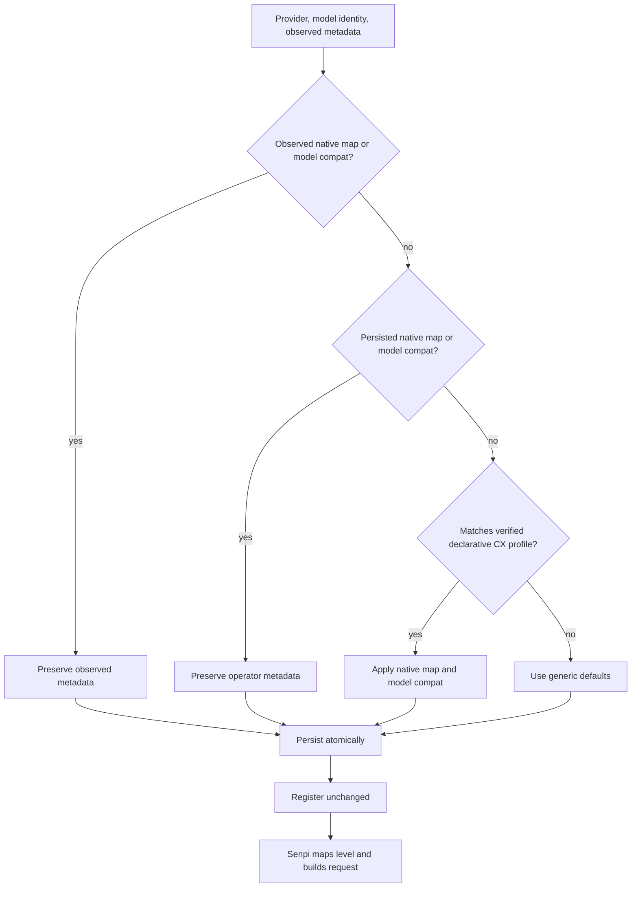

## Goal Capsule

- **Objective:** Let an OMO operator configure supported thinking levels for a custom provider model without emitting a provider/model effort the upstream rejects.
- **Means:** Persist Senpi-native generic per-model `thinkingLevelMap` metadata and seed a declarative 9router CX profile; do not add request-translation logic. (KTD1, KTD2)
- **Product authority:** This plan owns Better Custom model metadata, its interactive editor, persistence, registration payload, and compatibility documentation.
- **Stop conditions:** No endpoint probing changes, router service changes, OMO route edits, automatic retries, or mappings for unverified 9router model families.

---

## Product Contract

### Summary

Add a generic per-model thinking-level mapping editor to Better Custom and apply a narrowly verified profile when 9router CX GPT-5.6 model entries are created or first seeded.
The persisted standard `thinkingLevelMap`, together with model compatibility metadata, determines the provider-facing reasoning effort Senpi emits.

### Problem Frame

OMO sent `minimal` to `9router/cx/gpt-5.6-luna`; 9router returned a deterministic `400` because Luna accepts `none`, `low`, `medium`, `high`, `xhigh`, and `max`, but not `minimal`.
The visible OMO result was a generic connection failure after the provider rejected the request.
Better Custom exposes an internal map shape but converts it into a private `thinking.effortMap` object and removes `thinkingLevelMap`; that is not the Senpi-native request-mapping field.
Users therefore cannot inspect or edit a complete native map, and gateway discovery cannot establish a router's effort contract.

### Requirements

**Generic mapping behavior**

- R1. Better Custom must retain a complete persisted per-model `thinkingLevelMap` with exactly the canonical OMO keys `off`, `minimal`, `low`, `medium`, `high`, `xhigh`, and `max`; every key maps to a provider-facing effort or unavailable state.
- R2. The model editor must let an interactive user inspect and replace the complete native mapping, including disabling unsupported levels, without relying on undocumented provider-specific controls.
- R3. A mapping edit must preserve unrelated model, provider, and top-level configuration fields; selected config format; and atomic-write behavior.
- R4. Provider registration must preserve `thinkingLevelMap` and model compatibility metadata unchanged. A mapped OpenAI-completions model must declare `supportsReasoningEffort: true` at the narrowest model scope required for Senpi to emit its mapped `reasoning_effort`; Better Custom must not rewrite request payloads.

**Narrow 9router CX seed**

- R5. A declarative seed must apply only to `9router` CX GPT-5.6 model identities and only when no observed or stored native map and no explicit model compatibility metadata exists; any existing map or compatibility is retained unchanged.
- R6. The Luna seed must map `off` to `none`, OMO `minimal` to `low`, retain `max`, and map OMO `xhigh` to `max`.
- R7. Sol and Terra seeds must map `off` to `none`, retain their native `max`, and preserve their native `ultra` mapping for OMO `xhigh`.
- R8. Unknown 9router families, other providers, and router catalog entries without verified effort evidence must receive no compatibility seed.

**Documentation and supportability**

- R9. The user-reported connection incident must name the deterministic rejected effort, distinguish it from a network or Better Custom registration fault, and state the profile's evidence boundary.
- R10. The Better Custom upstream-validation record must identify the OMO/Senpi host contract, live local proof, and revalidation triggers for model or gateway changes.

### Source-local native map contract

`thinkingLevelMap` is persisted Senpi-native metadata with exactly seven OMO keys: `off`, `minimal`, `low`, `medium`, `high`, `xhigh`, and `max`. Each key contains a provider-facing effort string or `null` for unavailable; `ultra` is a provider value, not an additional OMO key.

Static profiles match provider `9router` plus exact model ID only:

| Model ID | `off` | `minimal` | `low` | `medium` | `high` | `xhigh` | `max` | `compat.supportsReasoningEffort` |
|---|---|---|---|---|---|---|---|---|
| `cx/gpt-5.6-luna` | `none` | `low` | `low` | `medium` | `high` | `max` | `max` | `true` |
| `cx/gpt-5.6-sol` | `none` | `minimal` | `low` | `medium` | `high` | `ultra` | `max` | `true` |
| `cx/gpt-5.6-terra` | `none` | `minimal` | `low` | `medium` | `high` | `ultra` | `max` | `true` |

Precedence is strict: observed native map or compatibility, stored native map or compatibility, exact profile, then generic defaults. Existing metadata is preserved as a complete map; profiles never partially merge into it. Better Custom persists and registers metadata only. Senpi resolves selected level and constructs requests; Better Custom does not inspect, intercept, or rewrite requests.

### Actors

- A1. **OMO operator** adds or edits a custom provider model and chooses supported thinking levels.
- A2. **Better Custom** persists and registers model metadata.
- A3. **Senpi / OMO host** resolves the requested level through the native map and builds a request.
- A4. **9router CX model endpoint** accepts only its supported provider-facing effort values.

### Key Flows

- F1. **Seeded model creation**
  - **Trigger:** A1 adds a verified 9router CX GPT-5.6 model through discovery or manual model entry.
  - **Steps:** Better Custom resolves generic model options, retains any observed or stored native map and explicit model compatibility, otherwise applies a matching declarative seed, persists the result, then refreshes registration.
  - **Outcome:** A3 resolves Luna `minimal` to provider `low`.
  - **Covers:** R1, R4-R8.

- F2. **Mapping correction**
  - **Trigger:** A1 opens a model's thinking-level mapping editor.
  - **Steps:** The editor presents every OMO thinking level with its current provider-facing value or disabled state; A1 confirms a replacement map; Better Custom normalizes it, atomically persists it, and refreshes the provider.
  - **Outcome:** The edited model exposes only configured supported choices without damaging unrelated configuration.
  - **Covers:** R1-R4.

- F3. **Non-matching or already-customized model**
  - **Trigger:** A model belongs to another provider/family, has no seed, or already has observed or stored native mapping or compatibility metadata.
  - **Steps:** Better Custom keeps that metadata and does not synthesize a CX compatibility profile.
  - **Outcome:** No speculative capability claim or overwrite.
  - **Covers:** R5, R8.

### Acceptance Examples

- AE1. Given a newly constructed Luna entry with the CX seed, when OMO selects `minimal`, then registered `thinkingLevelMap` maps it to `low` and model compatibility enables native OpenAI reasoning-effort emission.
- AE2. Given a seeded Luna entry, when OMO selects `xhigh`, then the registered map emits `max`; selecting `max` remains `max`.
- AE3. Given a seeded Sol or Terra entry, when OMO selects `xhigh` or `max`, then the registered map emits `ultra` or `max` respectively.
- AE4. Given a model with an explicit user native map or explicit model compatibility, when provider models are refreshed, then those fields and unrelated fields remain unchanged.
- AE5. Given an unknown 9router model or another provider, when models are added or refreshed, then no CX seed is attached.
- AE6. Given a valid mapping edit, when it is saved, then JSON or YAML retains unknown fields, has no temporary sibling, and refreshed registration contains the native map.
- AE7. Given a disabled level in the editor, when the map is saved, then the map holds `null` for that level and Senpi does not select it as a supported level.

### Scope Boundaries

- **Deferred for later:** 9router profiles for non-CX families, automatic capability discovery from live request failures, provider-side capability negotiation, and import/export of reusable mapping profiles.
- **Outside this product's identity:** Changes to 9router request translation, OMO/Senpi core request construction, OMO routing templates, credentials, retry/backoff behavior, and endpoint autodetection.

### Sources / Research

- Local incident: `docs/issues.md` records direct SSE success but full OMO failure; later session evidence identified the rejected Luna `minimal` request.
- Native host boundary: `node_modules/@earendil-works/pi-ai/dist/types.d.ts` and `node_modules/@earendil-works/pi-ai/dist/model.d.ts` define native `thinkingLevelMap` and model compatibility; `node_modules/@earendil-works/pi-ai/dist/api/openai-completions.js` resolves that map and emits mapped `reasoning_effort` only when compatibility enables it.
- Extension composition: `node_modules/@code-yeongyu/senpi/dist/core/provider-composer.js` composes model `thinkingLevelMap` and merged provider/model compatibility. `extensions/better-custom/src/model-browser.ts` currently preserves unknown registration fields.
- Existing incorrect seam: `extensions/better-custom/src/model-entry.ts` converts a map to private `thinking.effortMap` and deletes the native map; `extensions/better-custom/src/flows/edit.ts` offers only a reasoning ceiling.
- Persistence seam: `extensions/better-custom/src/config.ts` serializes active JSON/YAML through temporary-file rename; `extensions/better-custom/src/flows/shared.ts` refreshes live provider registration after a targeted mutation.
- [9router CX reasoning design](https://github.com/decolua/9router/blob/a8c9d3802c5933500fba95416f5bf0c130581396/docs/superpowers/specs/2026-08-02-gpt-5-6-codex-reasoning-overrides-design.md) defines the CX-only matrix: Sol and Terra support Max and Ultra; Luna supports Max and maps Ultra to Max.
- [9router CX reasoning plan](https://github.com/decolua/9router/blob/a8c9d3802c5933500fba95416f5bf0c130581396/docs/superpowers/plans/2026-08-02-gpt-5-6-codex-reasoning-overrides.md) uses a static provider/model resolver and forbids runtime catalog fetching.
- [9router skill](https://github.com/decolua/9router/blob/a8c9d3802c5933500fba95416f5bf0c130581396/skills/9router/SKILL.md) documents `GET /v1/models` as route-ID discovery without a reasoning-capability field. The catalog is not effort-contract authority.

---

## Planning Contract

### Key Technical Decisions

- KTD1. **Persist a native generic map; do not intercept requests.** Replace Better Custom's private `thinking` conversion with standard persisted `thinkingLevelMap` and model-scoped compatibility metadata. Senpi then maps the selected level and constructs the OpenAI-completions request. (session-settled: user-approved — chosen over a 9router-specific runtime adapter: Better Custom must provide a reusable profile-mapping compatibility layer.) Governs R1-R4.
- KTD2. **Seed narrowly and never overwrite existing metadata.** Match only 9router CX GPT-5.6 identities with upstream-backed mappings, apply them only during entry construction when no observed or stored native map and no explicit compatibility exists, and keep all other models unprofiled. (session-settled: user-directed — chosen over broad all-family mappings: other families lack verified effort contracts.) Governs R5-R8.
- KTD3. **Treat profile data as a lowest-precedence default.** An existing observed native map wins over a profile; any persisted native map or explicit model compatibility also wins. Refresh must not replace any existing map or compatibility. Governs R3, R5, R8.
- KTD4. **Use a complete map editor instead of ceiling-only overrides.** The existing ceiling editor cannot express Luna `minimal → low`, `xhigh → max`, or disabled states. The new editor owns every OMO level and writes native map values or `null`; ceiling edits reject models with a native map and direct operators to this editor. Governs R1-R3, R6-R7.

### High-Level Technical Design

### Design Constraints

- The compatibility profile is data plus matching logic at the model-metadata boundary. It must not inspect, mutate, retry, or suppress a live request.
- Persist only native canonical map keys with non-empty provider strings or `null`. No router-only `ultra` key exists; `ultra` is a provider value for the canonical OMO `xhigh` key.
- Map provenance must remain observable after persistence. Retaining the native map in stored model entries is the source-of-truth and overwrite guard; do not derive overwrite decisions from the private `thinking` object.
- Profile construction must set `supportsReasoningEffort` only on matching model entries, not provider-wide, so unprofiled models retain their existing behavior.
- Preserve current manual provider-add and refresh behavior; a profile must work whether metadata was discovered or omitted.

### Sequencing

1. Establish native-map profile composition and round-trip model-entry behavior first.
2. Expose generic complete-map editing through existing targeted mutation path.
3. Document evidence boundary and run focused host-facing validation.

### Risks and Mitigations

- **9router capability drift:** Gate seeds by exact provider/model identity, record source version/date, and revalidate after gateway or model changes.
- **User override loss during refresh:** Persist native map and model compatibility, make them higher precedence than profiles, and add refresh regression coverage.
- **No `reasoning_effort` wire field:** Assert matching model compatibility is registered with the native map; validate a real isolated request payload/result after current-runtime evidence.
- **False universal claim:** Do not seed non-CX model families or derive mappings from catalog presence.

---

## Implementation Units

### U1. Add native compatibility-profile composition for model thinking maps

- **Goal:** Give model-entry construction a precedence-aware source for declarative native maps without provider transport behavior.
- **Requirements:** R1, R3-R8. KTD1-KTD3.
- **Dependencies:** None.
- **Files:** `extensions/better-custom/src/types.ts`, `extensions/better-custom/src/model-entry.ts`, new focused profile module under `extensions/better-custom/src/`, `extensions/better-custom/test/model-entry.test.ts`.
- **Approach:**
  1. Define a small host-neutral profile shape that matches provider/model identity and supplies model-option defaults, including native map and model-scoped compatibility metadata.
  2. Add only verified 9router CX GPT-5.6 data: Luna maps `minimal` to `low` and `xhigh` to `max`; Sol and Terra map `xhigh` to `ultra`; all preserve their stated `max` mapping and `off → none`.
  3. Use one strict precedence order: observed native map/model compatibility; then persisted native map/model compatibility; then matching profile defaults; then generic defaults. A profile never fills or replaces individual keys in an existing map.
  4. Remove the private map-to-`thinking` conversion from profile construction and mutation. Build/read/mutate model entries must preserve native map values directly.
- **Patterns to follow:** `modelOptionsWithInfo`, `copyThinkingLevelMap`, `buildModelEntry`, and `mutateModelEntry` in `extensions/better-custom/src/model-entry.ts`; host-native model schema evidence cited in Sources.
- **Test scenarios:**
  - Construct Luna, Sol, and Terra entries through the profile path and assert all seven canonical keys plus exact map values and model compatibility for minimal, xhigh, and max.
  - Construct nonmatching provider, non-CX model, and unknown CX model; assert no profile map or compatibility is added.
  - Construct and refresh models with observed native map/model compatibility, then persisted native map/model compatibility; assert each wins intact over matching profile data.
  - Round-trip a map containing `null`; assert all seven keys, including the unavailable value, remain intact.
- **Verification:** Model construction and read/mutation round trips preserve native generic data, apply only verified seeds, and require no request-layer code.

### U2. Add complete native thinking-map editing and safe refresh preservation

- **Goal:** Let an operator update supported provider effort values per model through Better Custom's interactive edit flow.
- **Requirements:** R1-R4, R6-R7. KTD3-KTD4.
- **Dependencies:** U1.
- **Files:** `extensions/better-custom/src/flows/edit.ts`, `extensions/better-custom/src/ui/prompts.ts`, `extensions/better-custom/src/model-entry.ts`, `extensions/better-custom/test/model-entry.test.ts`, new or existing focused flow test under `extensions/better-custom/test/`.
- **Approach:**
  1. Add a model-editor action for a complete native map, separate from the existing ceiling shortcut.
  2. Reuse host UI seams to collect valid provider-facing values or disabled levels, normalize all seven canonical OMO keys, and route the replacement through existing `updateModel` and `mutateProvider` paths.
  3. Make unrelated edits preserve native maps; when a model has a native map, reject its ceiling edit without a write and direct the operator to the complete-map editor.
  4. Ensure refresh merges observed metadata without replacing explicit native map or model compatibility; profiles must not reapply over edited entries.
  5. Keep noninteractive command behavior unchanged: interactive-only commands continue to refuse JSON, print, and RPC mutations.
- **Patterns to follow:** `editSingleModel` and `updateModel` in `extensions/better-custom/src/flows/edit.ts`; `mutateProvider` in `extensions/better-custom/src/flows/shared.ts`; prompt behavior in `extensions/better-custom/src/ui/prompts.ts`.
- **Test scenarios:**
  - Edit a map with Luna minimal and xhigh overrides; assert persisted entry and refreshed registration retain native map plus model compatibility.
  - Disable one level; assert its native map value is `null` without affecting other keys.
  - Cancel or provide invalid mapping input; assert configuration remains unchanged.
  - Edit an unrelated field or refresh a provider containing a user-edited map and unknown fields; assert neither map nor fields are lost.
  - Invoke the reasoning ceiling edit on a model with a native map; assert a no-write rejection that directs the operator to the complete-map editor.
- **Verification:** Interactive flow makes one targeted, atomic configuration update and refreshes provider registration; invalid, cancelled, and rejected-ceiling paths cause no write.

### U3. Update support records and prove native host behavior

- **Goal:** Make the compatibility boundary auditable and leave reproducible evidence for future gateway/runtime changes.
- **Requirements:** R4, R9-R10.
- **Dependencies:** U1, U2.
- **Files:** `extensions/better-custom/README.md`, `extensions/better-custom/AGENTS.md`, `docs/issues.md`, `docs/upstream-validation.md`, `extensions/better-custom/test/model-browser.test.ts`, `extensions/better-custom/test/config.test.ts`.
- **Approach:**
  1. Describe native per-model maps as generic Better Custom metadata, identify model-scoped `supportsReasoningEffort` as needed for OpenAI-completions mapping, and state that Senpi owns request construction.
  2. Amend the 9router incident with observed Luna `minimal` rejection, profile scope, and revalidation trigger; do not present it as a network repair.
  3. Refresh Better Custom upstream-validation record with actual OMO, Senpi, Bun, upstream URLs, focused tests, and live OMO evidence.
  4. Extend registration and persistence tests only where they prove native map/compat registration or unknown-field/atomic-write preservation.
- **Patterns to follow:** field-preserving registration in `extensions/better-custom/src/model-browser.ts`; atomic persistence in `extensions/better-custom/src/config.ts`; issue-record format in `docs/issues.md`.
- **Test scenarios:**
  - Register mapped custom model and assert registration preserves `thinkingLevelMap` and model-scoped `supportsReasoningEffort`.
  - Save a config with unknown top-level/provider/model fields and a native map edit; assert fields survive and no temporary file remains.
- **Verification:** Documentation cites actual runtime evidence, and registration/persistence tests prove native metadata reaches the host without destructive rewriting.

---

## Verification Contract

| Scope | Evidence |
|---|---|
| U1 and U2 | `bun test extensions/better-custom/test` with model-entry and flow cases for native map composition, no-match behavior, overrides, disabled levels, cancellation, ceiling behavior, and refresh preservation. |
| U3 | `bun run typecheck` and `bun run build` after focused tests pass. |
| Extension load | `omo list --approve` from repository root verifies Better Custom loads and registers. |
| Live OMO boundary | In an isolated temporary agent directory, load a seeded Luna provider configuration, inspect effective registered model metadata, then send a minimal safe request only after confirming exact model and endpoint. OMO `minimal` must emit provider `low`, not `minimal`. |
| Regression safety | Run `mise ci` before handoff because Better Custom contract requires repository CI after changes. |

## Definition of Done

- Generic per-model native `thinkingLevelMap` values can be created, read, edited, persisted, and registered without provider-specific request interception.
- Matching OpenAI-completions models register `supportsReasoningEffort` at model scope; Luna maps minimal to low and xhigh to max; Sol and Terra map xhigh to ultra and preserve max.
- Existing explicit maps/model compatibility and unknown configuration fields survive refresh and atomic persistence.
- No profile applies to unverified models or other providers.
- Focused Better Custom tests, typecheck, build, extension-load check, live OMO metadata/request proof, and `mise ci` pass with recorded evidence.
- `docs/issues.md`, `docs/upstream-validation.md`, Better Custom documentation, and relevant `AGENTS.md` contracts are current; no abandoned experiment code remains.
